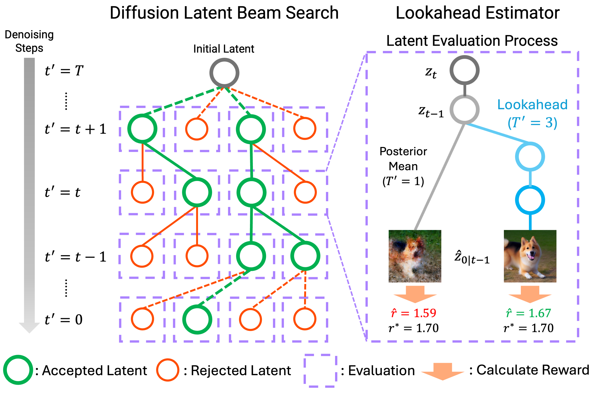
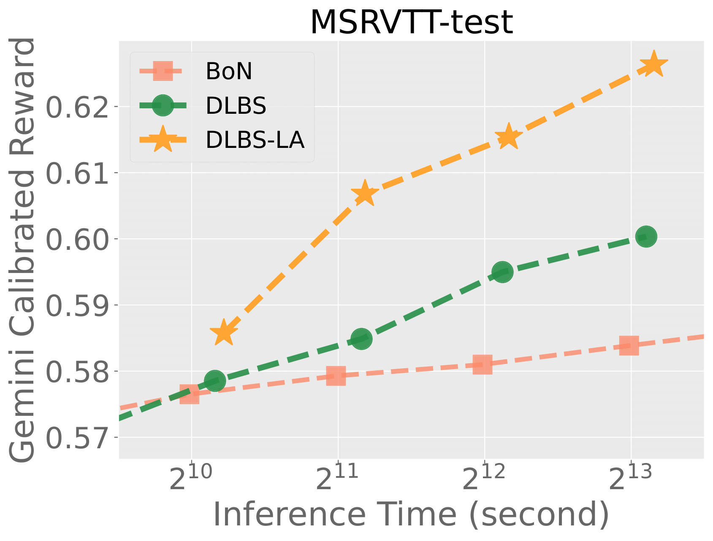
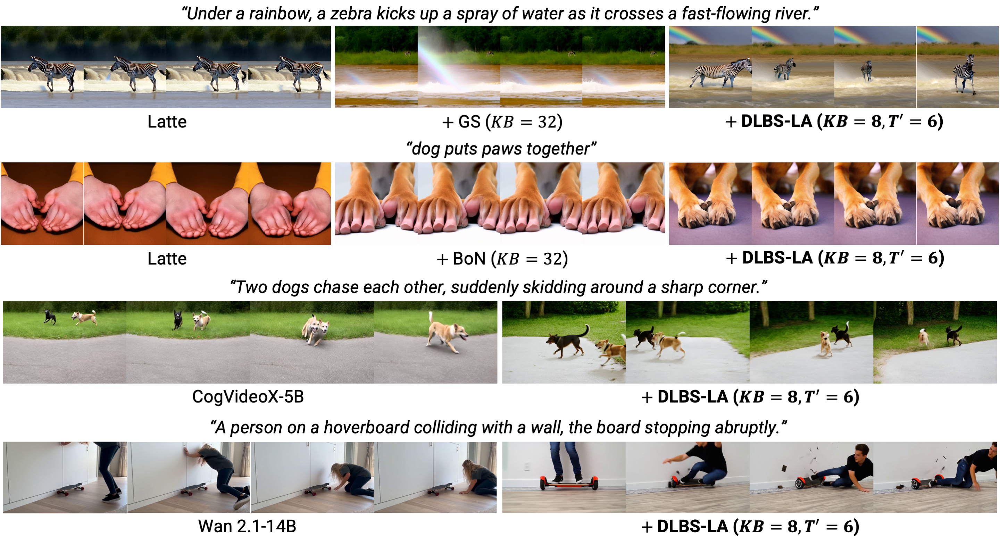

<h1 align="center">Inference-Time Text-to-Video Alignment with Diffusion Latent Beam Search</h1>

<p align="center">
    <b>NeurIPS 2025</b>
</p>

<div align="center">

[](https://arxiv.org/abs/2501.19252)
[](https://sites.google.com/view/t2v-dlbs)

<!--  -->
 

</div>

As done in recent LLMs, we consider scaling test-time compute in text-to-video generation. **Diffusion Latent Beam Search** efficiently and robustly maximizes alignment rewards during inference.

<div align="center">

 

</div>

We provide implementations for several state-of-the-art models, including **Latte**, **CogVideoX**, and **Wan 2.1**. Animated results are shown in [project website](https://sites.google.com/view/t2v-dlbs).

## 🚀 Getting Started with Latte
### Install Libraries
Please use `./Dockerfile` to build docker image or install python libraries specified in this dockerfile.

### Download Weights
```
bash download_weight.sh
```

### Run Inference
We provide two configuration files in the `configs/${method}` directory. 
Below are examples of how to run inference with different settings:
```
# No DLBS 
python3 sample/sample_t2x.py --config configs/kb1/static.yaml
# DLBS 
python3 sample/sample_t2x.py --config configs/dlbs/static.yaml
# DLBS-LA 
python3 sample/sample_t2x.py --config configs/dlbs_la/static.yaml
```

## 🦋 Setup & Inference with CogVideoX

### Install Libraries
```
cd CogVideoX/
pip3 install -r requirements.txt
cd ../
```

### Download Weights
```
bash download_weight.sh
cp -r pretrained CogVideoX
```

### Run Inference
We provide a configuration file in the `configs/${method}` directory. 
Below are examples of how to run inference with different settings:

#### 5B models
```
# No DLBS
python3 CogVideoX/sample.py --config CogVideoX/configs/kb1/very_high.yaml
# DLBS 
python3 CogVideoX/sample.py --config CogVideoX/configs/dlbs/very_high.yaml
# DLBS-LA 
python3 CogVideoX/sample.py --config CogVideoX/configs/dlbs_la/very_high.yaml
```

#### 2B models
```
# No DLBS
python3 CogVideoX/sample_2b.py --config CogVideoX/configs/kb1/very_high.yaml
# DLBS 
python3 CogVideoX/sample_2b.py --config CogVideoX/configs/dlbs/very_high.yaml
# DLBS-LA 
python3 CogVideoX/sample_2b.py --config CogVideoX/configs/dlbs_la/very_high.yaml
```

## 🌏 Setup & Inference with Wan 2.1

### Install Libraries
```
pip install torch==2.4.0
cd Wan2.1
pip install -r requirements.txt
cd ../
```

### Download Weights
```
bash download_weight.sh
cp -r pretrained Wan2.1

pip install modelscope
cd Wan2.1
modelscope download Wan-AI/Wan2.1-T2V-14B --local_dir ./Wan2.1-T2V-14B
modelscope download Wan-AI/Wan2.1-T2V-1.3B --local_dir ./Wan2.1-T2V-1.3B
cd ../
```

### Run Inference
We provide a prompts file in the `configs/movie_gen.yaml` directory. 
Below are examples of how to run inference with different settings:

#### 14B models
```
cd Wan2.1

# No DLBS
torchrun --nproc_per_node=8 my_generate.py --task t2v-14B --size 832*480 --ckpt_dir ./Wan2.1-T2V-14B --dit_fsdp --t5_fsdp --ulysses_size 8 --sample_solver 'dpm++' --sample_steps 50 --frame_num 33 --save_img_path "./results_sampling/wan/" --num_beams 1 --num_candidates 1 --config config/movie_gen.yaml
# DLBS 
torchrun --nproc_per_node=8 my_generate.py --task t2v-14B --size 832*480 --ckpt_dir ./Wan2.1-T2V-14B --dit_fsdp --t5_fsdp --ulysses_size 8 --sample_solver 'dpm++' --sample_steps 50 --frame_num 33 --save_img_path "./results_sampling/wan/" --num_beams 4 --num_candidates 2 --use_dlbs --config config/movie_gen.yaml
# DLBS-LA 
torchrun --nproc_per_node=8 my_generate.py --task t2v-14B --size 832*480 --ckpt_dir ./Wan2.1-T2V-14B --dit_fsdp --t5_fsdp --ulysses_size 8 --sample_solver 'dpm++' --sample_steps 50 --frame_num 33 --save_img_path "./results_sampling/wan/" --num_beams 4 --num_candidates 2 --num_backtrack_steps 6 --use_dlbs --config config/movie_gen.yaml
```

#### 1.3B models
```
cd Wan2.1

# No DLBS
torchrun --nproc_per_node=4 my_generate.py --task t2v-1.3B --size 832*480 --ckpt_dir ./Wan2.1-T2V-1.3B --dit_fsdp --t5_fsdp --ulysses_size 4 --sample_solver 'dpm++' --sample_steps 50 --frame_num 33 --save_img_path "./results_sampling/wan/" --num_beams 1 --num_candidates 1 --config config/movie_gen.yaml
# DLBS 
torchrun --nproc_per_node=4 my_generate.py --task t2v-1.3B --size 832*480 --ckpt_dir ./Wan2.1-T2V-1.3B --dit_fsdp --t5_fsdp --ulysses_size 4 --sample_solver 'dpm++' --sample_steps 50 --frame_num 33 --save_img_path "./results_sampling/wan/" --num_beams 4 --num_candidates 2 --use_dlbs --config config/movie_gen.yaml
# DLBS-LA 
torchrun --nproc_per_node=4 my_generate.py --task t2v-1.3B --size 832*480 --ckpt_dir ./Wan2.1-T2V-1.3B --dit_fsdp --t5_fsdp --ulysses_size 4 --sample_solver 'dpm++' --sample_steps 50 --frame_num 33 --save_img_path "./results_sampling/wan/" --num_beams 4 --num_candidates 2 --num_backtrack_steps 6 --use_dlbs --config config/movie_gen.yaml
```

## 📚 Citation

```bibtex
@article{oshima2025inference,
  title     = {Inference-Time Text-to-Video Alignment with Diffusion Latent Beam Search},
  author    = {Yuta Oshima and Masahiro Suzuki and Yutaka Matsuo and Hiroki Furuta},
  journal   = {arXiv preprint arXiv:2501.19252},
  year      = {2025},
  url       = {https://arxiv.org/abs/2501.19252},
}
```

## 🙏 Acknowledgements

We sincerely thank those who have open-sourced their works including, but not limited to, the repositories below:

- https://github.com/huggingface/diffusers
- https://github.com/Vchitect/Latte 
- https://github.com/zai-org/CogVideo
- https://github.com/Wan-Video/Wan2.1
- https://github.com/Vchitect/VBench 
- https://github.com/AILab-CVC/VideoCrafter
- https://github.com/CIntellifusion/VideoDPO
